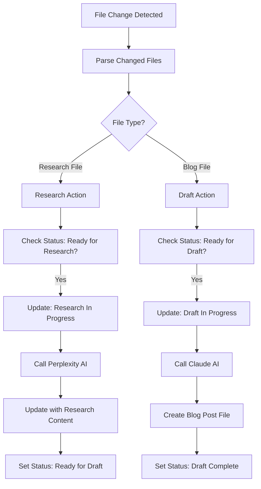

# Editorial Workflow GitHub Actions

An event-driven GitHub Actions implementation that automates blog content research and draft writing using AI. This system replaces the polling-based `git-timed-workflow.js` with a responsive, on-demand workflow triggered by file changes.

## Overview

This GitHub Action processes markdown files through a two-stage editorial workflow:

1. **Research Stage**: Files with status "Ready for Research" are processed using Perplexity AI
2. **Draft Writing Stage**: Files with status "Ready for Draft" are processed using Claude AI to generate blog posts

The workflow is triggered automatically when files are added or modified in the content directories, eliminating the need for polling or JSON file management.

## Architecture

### Core Components

#### 1. Action Orchestration (`src/index.ts`)
- Main entry point that coordinates the entire workflow
- Reads configuration from GitHub Action inputs and environment variables
- Determines which files need processing based on git changes
- Orchestrates research and draft actions

#### 2. Research Action (`src/actions/research-action.ts`)
- Processes files with status "Ready for Research"
- Updates status to "Research In Progress" during processing
- Uses Perplexity AI to generate comprehensive research content
- Updates files with research results and sets status to "Ready for Draft"
- Handles errors by setting status to "Error" with error details

#### 3. Draft Action (`src/actions/draft-action.ts`)
- Processes files with status "Ready for Draft"
- Updates status to "Draft In Progress" during processing
- Uses Claude AI to generate blog posts from research content
- Creates new blog post files in the blog directory
- Updates original research files to "Draft Complete" status

#### 4. AI Clients
- **Perplexity Client** (`src/clients/perplexity-client.ts`): Handles research generation
- **Claude Client** (`src/clients/claude-client.ts`): Handles blog post creation
- **GitHub Client** (`src/clients/github-client.ts`): Manages all GitHub API interactions

#### 5. Utilities (`src/utils/helpers.ts`)
- Status validation and transition logic
- File path utilities and slug generation
- Logging and error handling helpers
- Configuration parsing and validation

### Data Flow



### Status Workflow

The system manages content through these status transitions:

1. `Ready for Research` → `Research In Progress` → `Ready for Draft`
2. `Ready for Draft` → `Draft In Progress` → `Draft Complete`
3. Any status → `Error` (on failure)
4. `Error` → Any valid starting status (for recovery)

## Programming Decisions

### 1. Event-Driven Architecture
**Decision**: Use GitHub Actions triggers instead of polling
**Rationale**: 
- Eliminates resource waste from continuous polling
- Provides immediate response to file changes
- Integrates naturally with Git workflow
- Reduces complexity by removing JSON file management

### 2. TypeScript Implementation
**Decision**: Build with TypeScript instead of JavaScript
**Rationale**:
- Enhanced type safety prevents runtime errors
- Better IDE support and developer experience
- Clearer interfaces for configuration and data structures
- Easier maintenance and refactoring

### 3. Modular Client Architecture
**Decision**: Separate clients for each external service
**Rationale**:
- Clear separation of concerns
- Easier testing and mocking
- Independent configuration per service
- Simplified error handling per service

### 4. GitHub Actions Logging
**Decision**: Use GitHub Actions core logging instead of custom logging
**Rationale**:
- Native integration with GitHub Actions UI
- Automatic log grouping and formatting
- Built-in support for warnings and errors
- Consistent with GitHub Actions best practices

### 5. Frontmatter-Based Status Management
**Decision**: Continue using YAML frontmatter for status tracking
**Rationale**:
- Maintains compatibility with existing content
- Provides versioned status history through Git
- Human-readable and editable
- No external database dependencies

### 6. Error Handling Strategy
**Decision**: Update file status to "Error" with error messages in frontmatter
**Rationale**:
- Preserves error context with the content
- Enables manual recovery workflows
- Provides clear audit trail
- Prevents infinite retry loops

## Installation

### 1. Add Secrets to Repository

Add the following secrets to your GitHub repository settings:

- `PERPLEXITY_API_KEY`: Your Perplexity AI API key
- `CLAUDE_API_KEY`: Your Anthropic Claude API key

### 2. Copy Action Files

Copy the entire `copilot-github-actions` directory to your repository root.

### 3. Install Dependencies

```bash
cd copilot-github-actions
npm install
```

### 4. Build the Action

```bash
npm run build
```

### 5. Create Workflow File

Create `.github/workflows/editorial-workflow.yml` in your repository:

```yaml
name: Editorial Workflow

on:
  push:
    branches: [main, develop]
    paths:
      - 'content/research/**/*.md'
      - 'content/blog/**/*.md'
  pull_request:
    branches: [main, develop]
    paths:
      - 'content/research/**/*.md'
      - 'content/blog/**/*.md'
  workflow_dispatch:
    inputs:
      force_scan:
        description: 'Force scan all content directories'
        required: false
        default: 'false'
        type: boolean

jobs:
  editorial-workflow:
    runs-on: ubuntu-latest
    name: Process Editorial Content
    
    permissions:
      contents: write
      pull-requests: read
      
    steps:
      - name: Checkout repository
        uses: actions/checkout@v4
        with:
          token: ${{ secrets.GITHUB_TOKEN }}
          fetch-depth: 0
          
      - name: Setup Node.js
        uses: actions/setup-node@v4
        with:
          node-version: '20'
          cache: 'npm'
          cache-dependency-path: 'copilot-github-actions/package.json'
          
      - name: Install dependencies
        run: |
          cd copilot-github-actions
          npm ci
          
      - name: Build action
        run: |
          cd copilot-github-actions
          npm run build
          
      - name: Run Editorial Workflow
        uses: ./copilot-github-actions
        with:
          github-token: ${{ secrets.GITHUB_TOKEN }}
          perplexity-api-key: ${{ secrets.PERPLEXITY_API_KEY }}
          claude-api-key: ${{ secrets.CLAUDE_API_KEY }}
          content-dir-research: 'content/research'
          content-dir-blog: 'content/blog'
          
      - name: Commit changes
        if: success()
        run: |
          git config --local user.email "action@github.com"
          git config --local user.name "Editorial Workflow Action"
          git add .
          if git diff --staged --quiet; then
            echo "No changes to commit"
          else
            git commit -m "Automated editorial workflow updates [skip ci]"
            git push
          fi
```

### 6. Content Directory Structure

Ensure your repository has the following structure:

```
content/
├── research/
│   ├── topic-1.md
│   └── topic-2.md
└── blog/
    ├── published-post-1.md
    └── published-post-2.md
```

### 7. File Format

Research files should have frontmatter like:

```yaml
---
title: "Your Topic Title"
status: "Ready for Research"
tags: ["tag1", "tag2"]
category: "technology"
---

# Your Topic Title

Initial content about the topic...
```

## Configuration Options

### Required Inputs

- `github-token`: GitHub token for API access (automatically provided)
- `perplexity-api-key`: Perplexity AI API key
- `claude-api-key`: Claude AI API key

### Optional Inputs

- `content-dir-research`: Research files directory (default: "content/research")
- `content-dir-blog`: Blog output directory (default: "content/blog")
- `github-branch`: Target branch (default: "main")
- `perplexity-model`: Perplexity model (default: "sonar-deep-research")
- `perplexity-temperature`: Perplexity temperature (default: "0.2")
- `perplexity-max-tokens`: Perplexity max tokens (default: "7000")
- `claude-model`: Claude model (default: "claude-3-sonnet-20240229")
- `claude-temperature`: Claude temperature (default: "0.7")
- `claude-max-tokens`: Claude max tokens (default: "4000")

## Usage

### 1. Create Research Files

Create markdown files in `content/research/` with status "Ready for Research":

```markdown
---
title: "The Future of AI in Web Development"
status: "Ready for Research"
tags: ["ai", "web-development", "future-tech"]
category: "technology"
---

# The Future of AI in Web Development

Brief overview of what we want to research...
```

### 2. Trigger Research

Commit and push the file. The action will:
1. Detect the file change
2. Update status to "Research In Progress"
3. Generate comprehensive research using Perplexity AI
4. Update the file with research content
5. Set status to "Ready for Draft"

### 3. Generate Draft

The action will automatically detect files ready for drafting and:
1. Update status to "Draft In Progress"
2. Generate blog post using Claude AI
3. Create new file in `content/blog/`
4. Update original research file to "Draft Complete"

### 4. Review and Publish

Review the generated blog post and update its status to "Published" when ready.

## Enhancements

### Short-term Improvements

1. **Enhanced Error Recovery**
   - Automatic retry logic for transient failures
   - Manual recovery workflows via GitHub Actions UI
   - Error categorization and specific handling

2. **Content Quality Controls**
   - Plagiarism detection integration
   - Content length and readability validation
   - Automated fact-checking capabilities

3. **Workflow Customization**
   - Configurable AI prompts per content category
   - Custom status workflows for different content types
   - Template-based content generation

4. **Performance Optimization**
   - Parallel processing of multiple files
   - Caching of API responses
   - Incremental research updates

### Medium-term Enhancements

1. **Advanced AI Integration**
   - Multi-model comparison and selection
   - Custom fine-tuned models for specific domains
   - AI-powered content optimization suggestions

2. **Collaboration Features**
   - Multi-author workflow support
   - Review and approval processes
   - Comment and feedback systems

3. **Analytics and Reporting**
   - Content performance tracking
   - Workflow efficiency metrics
   - AI usage analytics and cost optimization

4. **Integration Ecosystem**
   - CMS integration (WordPress, Ghost, etc.)
   - SEO tools integration
   - Social media scheduling

### Long-term Vision

1. **Intelligent Content Strategy**
   - AI-driven content planning and scheduling
   - Trend analysis and topic suggestions
   - Audience-specific content optimization

2. **Multi-format Content Generation**
   - Video scripts and presentations
   - Podcast outlines and show notes
   - Interactive content and infographics

3. **Advanced Workflow Automation**
   - Smart content distribution
   - Automated A/B testing
   - Performance-based content optimization

## Troubleshooting

### Common Issues

1. **Action not triggering**
   - Check file paths match the workflow triggers
   - Ensure files have correct frontmatter format
   - Verify repository permissions

2. **API failures**
   - Verify API keys are correctly set in repository secrets
   - Check API rate limits and quotas
   - Review error messages in action logs

3. **Git commit failures**
   - Ensure the action has write permissions
   - Check for branch protection rules
   - Verify git configuration in workflow

### Debug Mode

Enable debug logging by setting the `ACTIONS_STEP_DEBUG` secret to `true` in your repository.

### Support

For issues and questions:
1. Check the GitHub Actions logs for detailed error messages
2. Review the troubleshooting section above
3. Open an issue in the repository with logs and configuration details

## License

MIT License - see LICENSE file for details.

## Contributing

1. Fork the repository
2. Create a feature branch
3. Make your changes with appropriate tests
4. Update documentation as needed
5. Submit a pull request

## Changelog

### v1.0.0
- Initial release with event-driven architecture
- Research and draft generation workflows
- TypeScript implementation with full type safety
- Comprehensive error handling and logging
